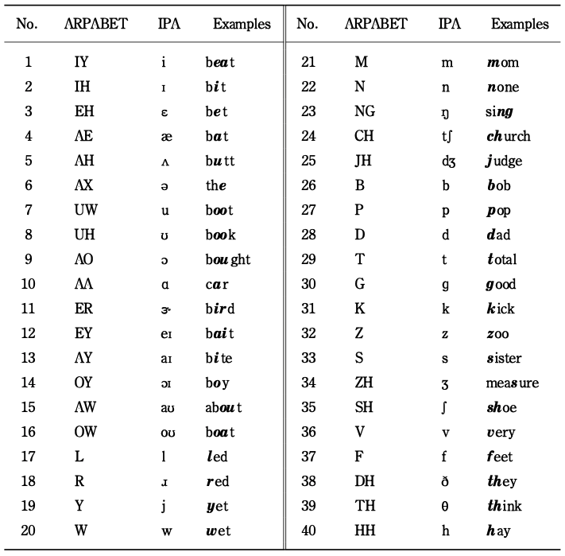

# Text2Video
This is code for ICASSP 2022: "Text2Video: Text-driven Talking-head Video Synthesis with Phonetic Dictionary".
[Project Page](https://sites.google.com/view/sibozhang/text2video) 

[)]([https://www.youtube.com/watch?v=_pcqH1illCU&feature=youtu.be](https://www.youtube.com/watch?v=VGQ4pH1vlcA))

## Introduction
With the advance of deep learning technology, automatic video generation from audio or text has become an emerging and promising research topic. In this paper, we present a novel approach to synthesize video from text. The method builds a phoneme-pose dictionary and trains a generative adversarial network (GAN) to generate video from interpolated phoneme poses. Compared to audio-driven video generation algorithms, our approach has a number of advantages: 1) It only needs a fraction of the training data used by an audio-driven approach; 2) It is more flexible and not subject to vulnerability due to speaker variation; 3) It significantly reduces the preprocessing, training and inference time. We perform extensive experiments to compare the proposed method with state-of-the-art talking face generation methods on a benchmark dataset and datasets of our own. The results demonstrate the effectiveness and superiority of our approach.

## Data / Preprocessing

## Set up
1. Git clone repo
```
git clone git@github.com:sibozhang/Text2Video.git
```

2. Download and install modified vid2vid repo [vid2vid](https://github.com/sibozhang/vid2vid) 

3. Download Trained model

Please build 'checkpoints' folder in vid2vid folder and put trained model in it.

VidTIMIT fadg0 (English, Female) Dropbox

百度云链接:https://pan.baidu.com/s/1L1cvqwLu_uqN2cbW-bDgdA 密码:hygt

Xuesong (Chinese, Male) Dropbox

百度云链接:https://pan.baidu.com/s/1lhYRakZLnkQ8nqMuLJt_dA 密码:40ob

4. Prepare data and folder in the following order

    ```
    Text2Video
    ├── *phoneme_data
    ├── model
    ├── ...
    vid2vid
    ├── ...
    venv
    ├── vid2vid
    ```
5. Setup env 
```
sudo apt-get install sox libsox-fmt-mp3
pip install zhon
pip install moviepy
pip install ffmpeg
pip install dominate
pip install pydub
```

For Chinese, we use vosk to get timestamp of each words.
Please install vosk from https://alphacephei.com/vosk/install and unpack as 'model' in the current folder.
or install:

```
pip install vosk
pip install cn2an
pip install pypinyin
```

## Testing
1. Activate vitrual environment vid2vid
```
source ../venv/vid2vid/bin/activate
```
2. Generate video with real audio in English
```
sh text2video_audio.sh $1 $2
```

Generate video with TTS audio in English
```
sh text2video_tts.sh $1 $2 $3
```

Generate video with TTS audio in Chinese
```
sh text2video_tts.sh $1 $2 $3
```

$1: "input text"
$2: person
$3: fill f for female or m for male (gender)

Example 1. test VidTIMIT data with real audio.
```
sh text2video_audio.sh "She had your dark suit in greasy wash water all year." fadg0 f
```
    
Example 2. test VidTIMIT data with TTS audio.
```
sh text2video_tts.sh "She had your dark suit in greasy wash water all year." fadg0 f
```

Example 3. test with Chinese female TTS audio.
```
sh text2video_tts_chinese.sh "正在为您查询合肥的天气情况。今天是2020年2月24日，合肥市今天多云，最低温度9摄氏度，最高温度15摄氏度，微风。" henan f
```
    
## Training with your own data

## Citation
Please cite our paper in your publications.

Sibo Zhang, Jiahong Yuan, Miao Liao, Liangjun Zhang. [PDF](https://arxiv.org/pdf/2104.14631.pdf) [Result Video](https://youtu.be/TQJCyQ4ISEg)
```
@article{zhang2021text2video,
  title={Text2Video: Text-driven Talking-head Video Synthesis with Phonetic Dictionary},
  author={Zhang, Sibo and Yuan, Jiahong and Liao, Miao and Zhang, Liangjun},
  journal={arXiv preprint arXiv:2104.14631},
  year={2021}
}
```

## Appendices
ARPABET


## Ackowledgements
This code is based on the vid2vid framework.
